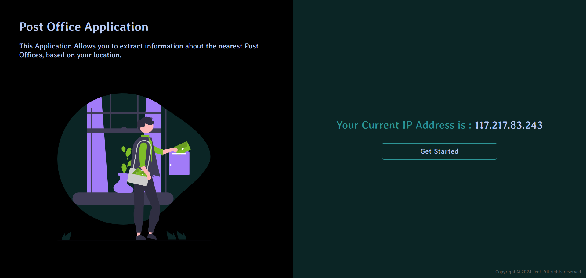
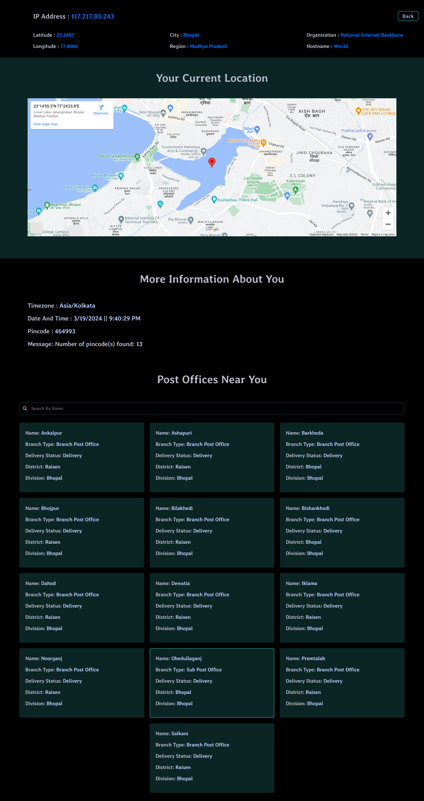

# Post Office Application

## Project Description

Post Office Application is a web application that enables users to retrieve information about nearby post offices based on their location. It provides features such as displaying location details, showing post offices on a map, and searching for specific post offices.

## Project Structure

The project is organized as follows:

- `PostOfficeApplication/`: The root directory of the Post Office Application project.
  - `images/`: A directory for storing images used in the application.
  - `index.html`: The main HTML file for the Post Office Application.
  - `Script.js`: JavaScript file containing logic for fetching data and handling user interactions.
  - `pageOne.css`, `pageTwo.css`: CSS files for styling the Post Office Application.
  - `README.md`: Project documentation and information.
  - `LICENSE`: The license file containing licensing information for the project.


## Table of Contents

- [Features](#features)
- [Getting Started](#getting-started)
  - [Prerequisites](#prerequisites)
  - [Tools Used](#tools-used)
  - [Starter Files](#starter-files)
- [Installation](#installation)
- [Usage](#usage)
- [Screenshots](#screenshots)
- [Like my work and want to support me?](#like-my-work-and-want-to-support-me)
- [FAQ](#faq)
- [Contributing](#contributing)
- [Feedback and Stars ⭐](#feedback-and-stars-)
- [License](#license)

## Features

- Retrieves and displays location details such as latitude, longitude, city, and region.
- Fetches post offices based on the user's location and displays them on the webpage.
- Shows the user's location on a map.
- Provides a search feature to find specific post offices by name.
- Responsive design for compatibility with various devices.

## Getting Started

### Prerequisites

- Web browser (Chrome, Firefox, Safari, etc.)

### Tools Used

- HTML5
- CSS3
- JavaScript (ES6+)

### Starter Files

The project includes the following starter files:

- `index.html`: The main HTML file for the web app.
- `script.js`: JavaScript file containing logic for recipe rendering and interactions.
- `pageOne.css`, `pageTwo.css`: CSS files for styling the web app.

## Installation

1. Clone the repository:

    ```bash
        git clone https://github.com/JEETAHIRWAR/Post-Office-Application.git
        cd Delicious-Food-WebApp

2. Open `index.html` in your preferred web browser.

---

## Usage

Open `index.html` in your preferred web browser. Click on the "Get Started" button to retrieve and display information about nearby post offices based on your location.

## Screenshots

### Page One


### Page Two


## Like my work and want to support me?

If you find this project helpful or interesting, consider giving it a star ⭐ and spreading the word!


## FAQ

**Question 1:** How does the application retrieve location details? 
**Answer:** The application uses the user's IP address to fetch location details from an API.

**Question 2:** Can I search for specific post offices? 
**Answer:** Yes, you can use the search input to find post offices by name.

**Question 3:** Is the application responsive?
**Answer:** Yes, the application is designed to work on various devices and screen sizes.


## Contributing

Contributions are welcome! Please follow the [Contributing Guidelines](CONTRIBUTING.md).

## Feedback and Stars ⭐

Feel free to provide feedback or give a star if you liked the project!

## License

This project is licensed under the [MIT License](LICENSE).
